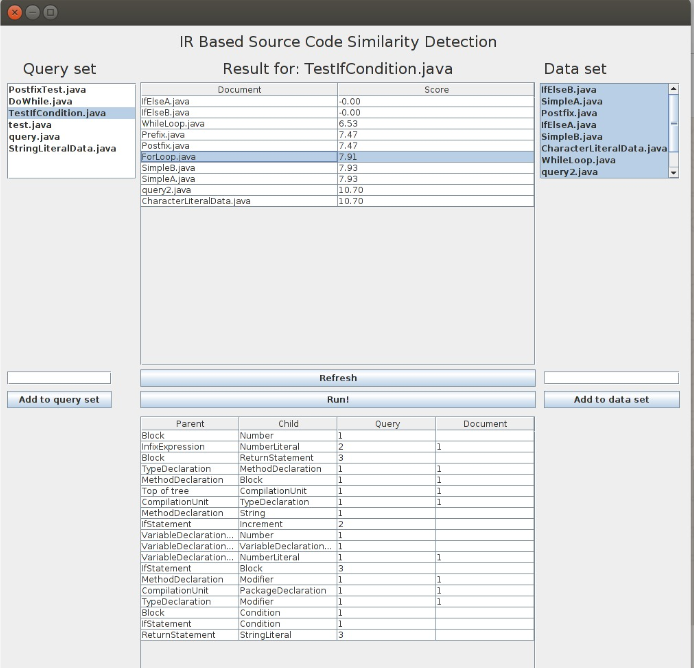

# ir_source_reuse_detection
Approach to identify similar java classes in a dataset. By creating representational queries for each  Document. Takes into account language constructs and structure. Finding similarity is reduced to  Finding the probability that a document was generated by a query.

# Running
Import project to your favorite IDE like Eclipse or IntelliJ( the libraries required will be downloaded)

Add your test Java classes into the src/queryset folder

Run the program and select the classes you want to compare with in the GUI

